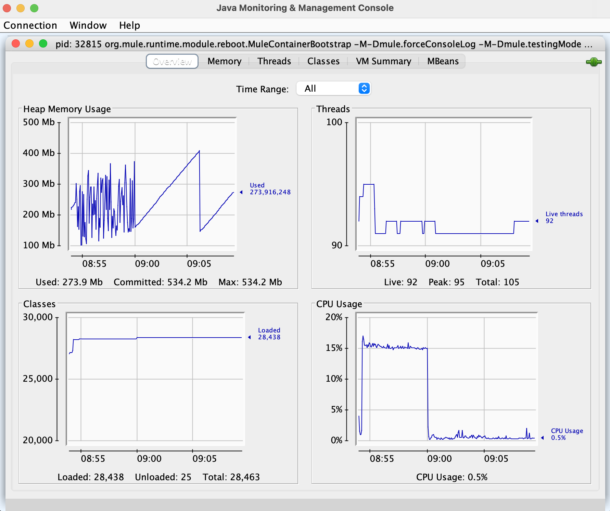

= Using Mule for streaming large CSV datasets

== Summary

This repository provides a Mule applciation which

* receives a HTTP stream with CSV content on a PUT endpoint
* Does some Dataweave transformations
* Writes the result to the disk.

The app can be fed using the companion "s-streamer" app.

== Running the app

The app was deployed to a Studio Mule runtime (5.4.3). The maximum heap size was set to 512m.

== Results

The app needed 345s to process am 100 m lines (2.7 G) dataset (Apple M1 max).

....
INFO  2024-01-24 08:54:15,206 [[MuleRuntime].uber.06: [s-streamer].s-filestreamFlow.CPU_LITE @3f946cea] [processor: s-filestreamFlow/processors/0; event: c4d284b0-ba8d-11ee-91c0-bcd07404b022] org.mule.runtime.core.internal.processor.LoggerMessageProcessor: start
INFO  2024-01-24 08:59:59,782 [[MuleRuntime].uber.09: [s-streamer].s-filestreamFlow.CPU_LITE @3f946cea] [processor: s-filestreamFlow/processors/3; event: c4d284b0-ba8d-11ee-91c0-bcd07404b022] org.mule.runtime.core.internal.processor.LoggerMessageProcessor: done.
....

The configured maximum heap size of 512M was not exceeded:

